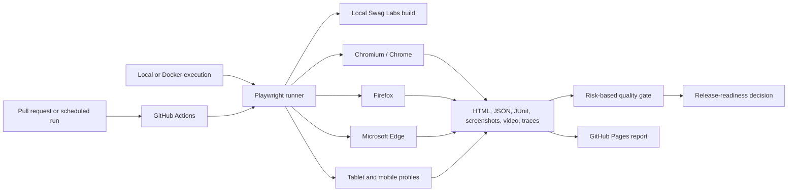

# Test Architecture

Page objects isolate user interactions, fixtures provide consistent test data, and test IDs link automation to requirements and defect reports. Browser projects own environment differences in one configuration file. CI separates browser failures while retaining evidence from every job.
